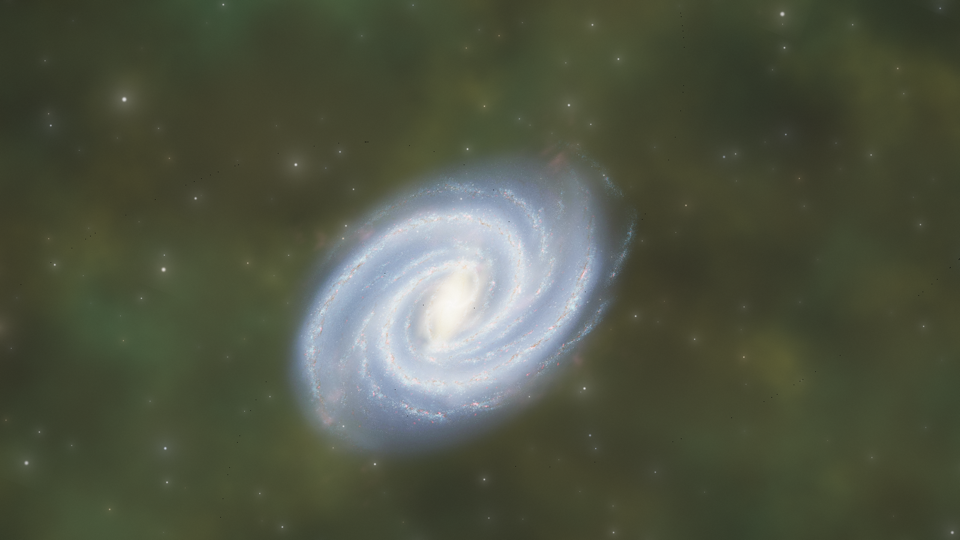
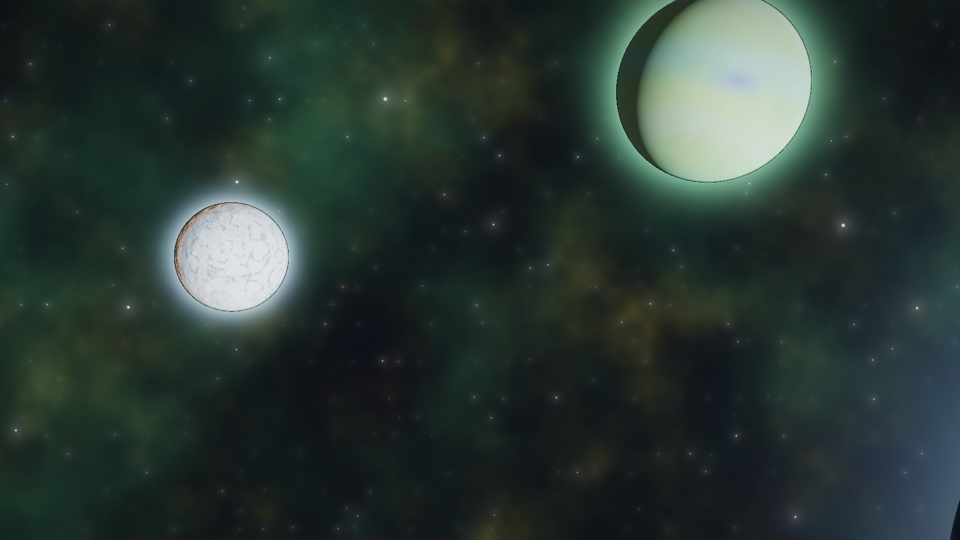
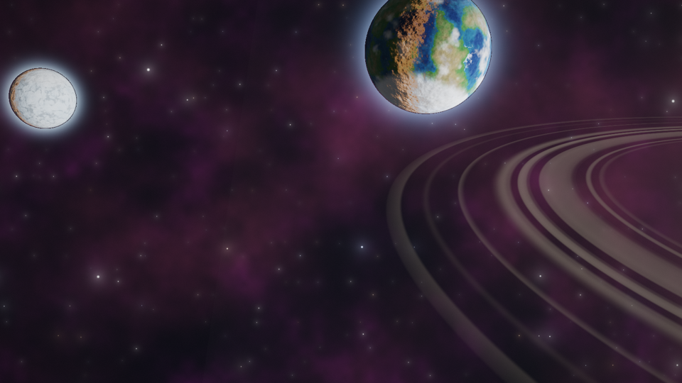
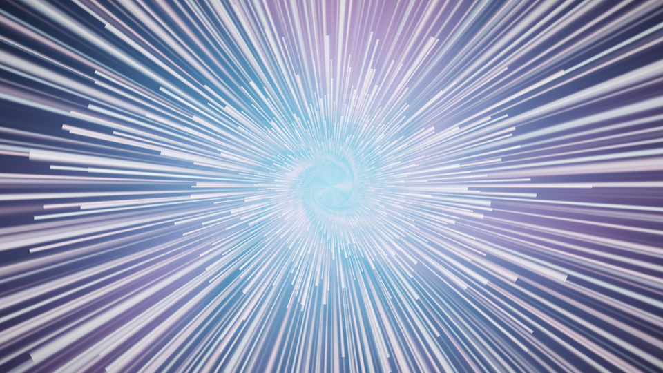
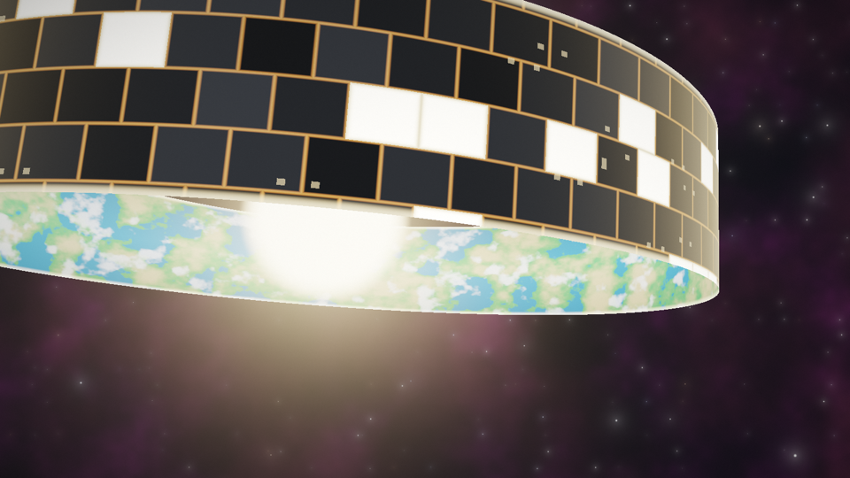
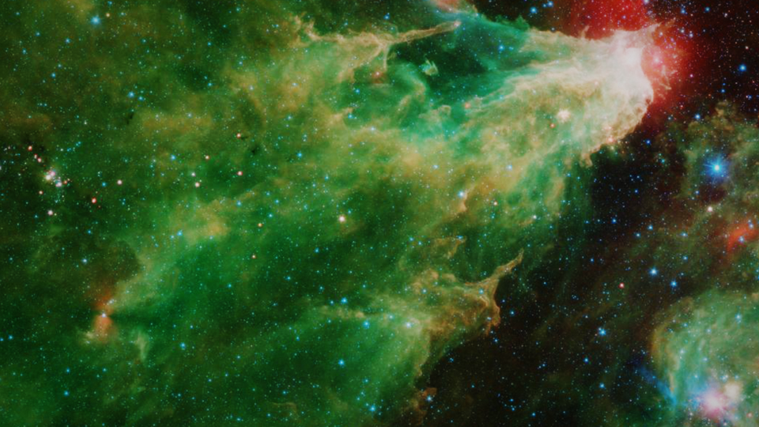
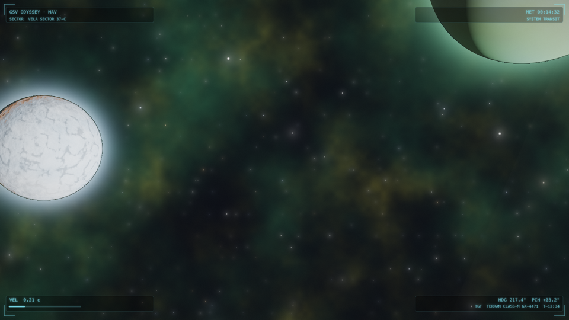

# Mac to the Stars — Galactic Odyssey Screensaver

A procedurally generated macOS screensaver that takes you on an endless flight
through the universe: out of the Milky Way's dust, past living solar systems,
through warp corridors, and — occasionally — straight through a hole in a
Dyson sphere.

Everything you see is computed live on the GPU by a single Metal shader.
No video files, no asset packs — just math, random seeds, and a handful of
real NASA archive photographs. No two journeys are ever the same.



## The journey

Every run opens on the Milky Way — a single dot that swells into a real
archive image, then dissolves into a volumetric, ray-marched galactic disk as
you plunge in. From there the ship's course is generated forever:

| | |
|---|---|
|  |  |
|  |  |
|  |  |

- **Solar-system transits** — fly into systems of up to five planets
  (terran, gas giant, volcanic, ice; some ringed) lit by their actual sun,
  with ~28% binary star pairs in mutual orbit
- **Galaxy approaches** — real NASA imagery far out, volumetric 3D disk up
  close, and a stellar neighborhood of mini solar systems (with planets
  visibly orbiting) as you fly through
- **Warp jumps** between regions — hyperspace streaks and a swirling energy
  tunnel, ending in a flash that reveals a new region with a new color palette
- **Rare encounters** — Dyson structures in three construction stages
  (Niven ring band, half-built shell, complete sphere with a full fly-through
  over its inner-surface oceans and mountain ranges), Dyson collector swarms,
  black holes with lensing and accretion disks, comet swarms
- **Deep-field observations** — slow drifts across real NASA/Hubble/Spitzer
  photographs
- **Starship HUD** (optional) — edge-only cockpit telemetry: sector and
  target names, velocity, heading, mission clock, and blinking amber warp
  readouts with your destination sector

Nothing ever pops into view: every body starts as a sub-pixel dot and grows
as you travel toward it.

## Install

Requires macOS 13+ and the Xcode Command Line Tools
(`xcode-select --install`). Apple Silicon and Intel both supported.

```sh
git clone https://github.com/WowWashington/Mac-to-the-stars-screensaver.git
cd Mac-to-the-stars-screensaver
./build.sh install
```

That builds the saver from source (no Xcode project needed), installs it to
`~/Library/Screen Savers/`, and selects it as your screensaver on all
displays. If you'd rather select it yourself in System Settings → Screen
Saver, install with:

```sh
SKIP_SELECT=1 ./build.sh install
```

The saver starts after your configured idle time (System Settings → Lock
Screen). To set it to 5 minutes from the terminal:

```sh
defaults -currentHost write com.apple.screensaver idleTime -int 300
```

### Options

In **System Settings → Screen Saver → Galactic Odyssey → Options…** you can
toggle the starship HUD. (Or:
`defaults -currentHost write com.petersheppard.GalacticOdyssey ShowHUD -bool NO`)

### Add your own NASA images

Drop any `.jpg` from [images.nasa.gov](https://images.nasa.gov) into
`SeedImages/`, add a credit line to `SeedImages/CREDITS.md`, and run
`./build.sh install`. It joins the deep-field rotation automatically — and if
the filename contains `milky` or `galaxy`, it also becomes a candidate for
the opening galaxy approach.

## Development

```sh
./build.sh preview              # render QA frames of every scene to Preview/
./build/preview Preview --bench # GPU cost per scene (ms/frame at QHD)
```

The whole renderer is one Metal fragment shader compiled at runtime
([Sources/ShaderSource.swift](Sources/ShaderSource.swift)); a scene director
([Sources/Director.swift](Sources/Director.swift)) schedules the journey and
the HUD telemetry. `CLAUDE.md` documents the scene-authoring recipe and
performance budget. Measured on an Apple Silicon Mac mini, every scene
renders in 2–12 ms per frame at QHD — comfortably 60 fps.

## License & credits

- **Code**: [MIT](LICENSE) © Peter Sheppard
- **Images**: courtesy NASA (not covered by the MIT license, and cannot be
  sublicensed). Full per-image provenance in
  [SeedImages/CREDITS.md](SeedImages/CREDITS.md). NASA does not endorse this
  project; no NASA insignia are included.
