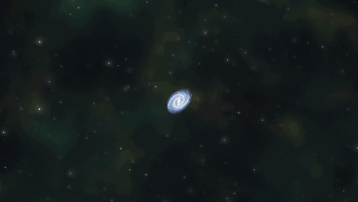
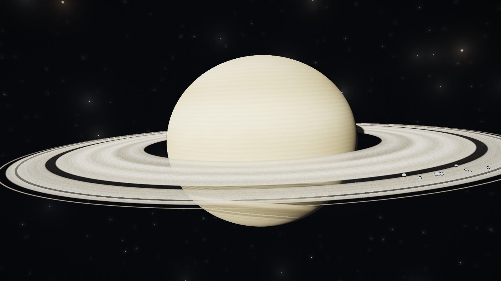
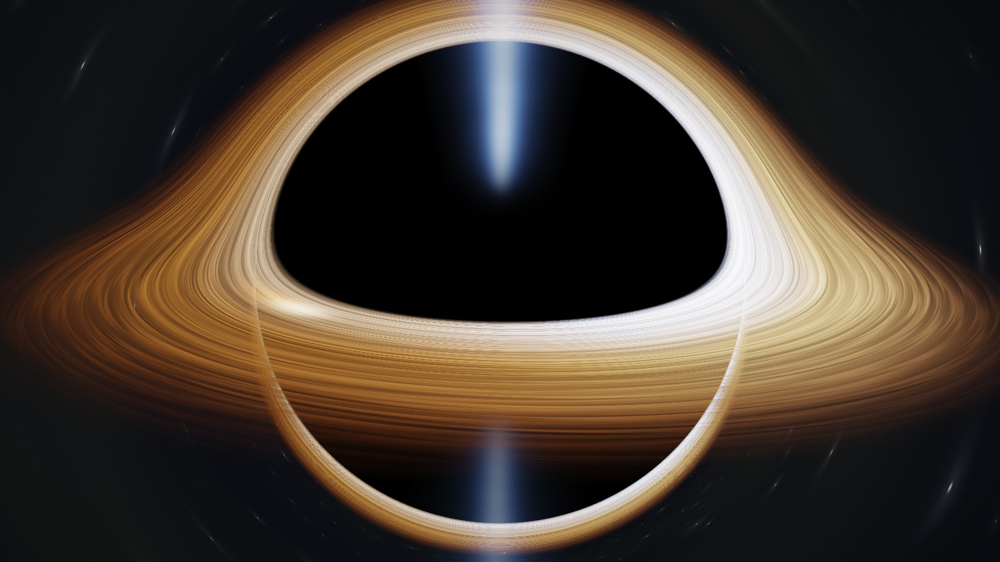
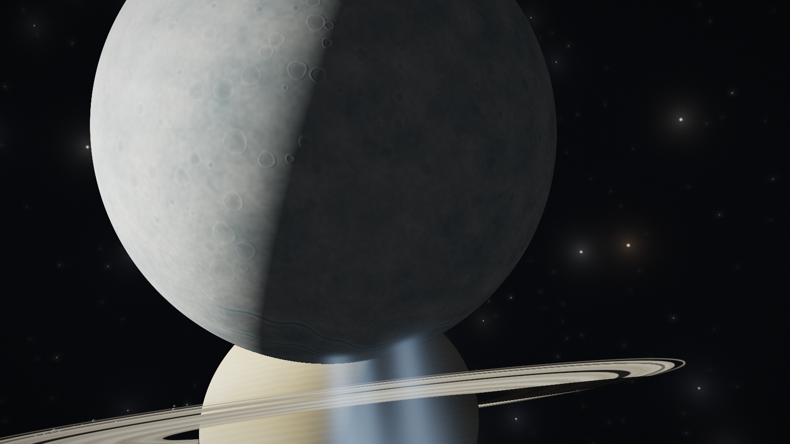
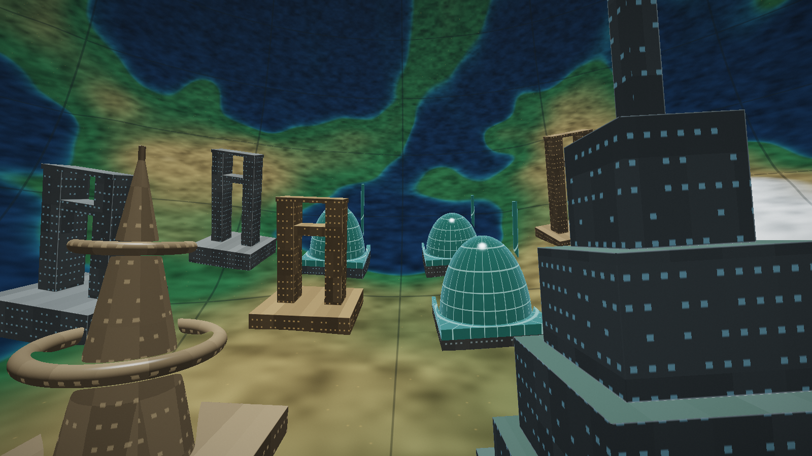
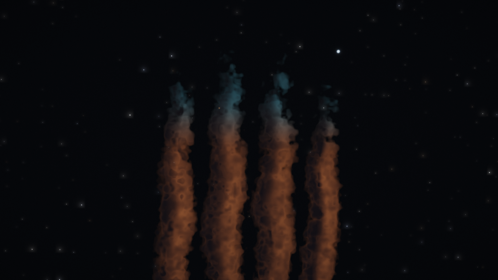
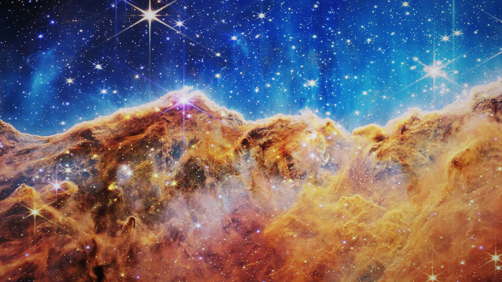

# Mac to the Stars — Galactic Odyssey Screensaver

A procedurally generated macOS screensaver that takes you on an endless flight
through the universe: out of the Milky Way's dust, past living solar systems,
through warp corridors, and — occasionally — straight through a hole in a
Dyson sphere.

Everything you see is computed live on the GPU by specialized Metal shaders.
No video files, no asset packs — just math, random seeds, and a handful of
real NASA archive photographs. No two journeys are ever the same.



## The journey

Every run opens on the Milky Way — a single dot that swells into a real
archive image, then dissolves into a volumetric, ray-marched galactic disk as
you plunge in. From there the ship's course is generated forever:

| | |
|---|---|
|  |  |
|  |  |
|  |  |

- **Solar-system transits** — fly into systems of up to five planets
  (terran, gas giant, volcanic, ice; some ringed) lit by their actual sun,
  with ~28% binary star pairs in mutual orbit
- **Galaxy approaches** — real NASA imagery far out, volumetric 3D disk up
  close, and a stellar neighborhood of mini solar systems (with planets
  visibly orbiting) as you fly through
- **Warp jumps** between regions — hyperspace streaks and a swirling energy
  tunnel, ending in a flash that reveals a new region with a new color palette
- **HOME SYSTEM** — a guided tour of our own Solar System: the Sun up close,
  rocky worlds, Jupiter's bands, Saturn's rings, and a hero pass of Earth —
  blue marble, night-side city lights — with the Moon alongside
- **Saturn expedition** — a continuous Cassini-inspired flight past Saturn,
  across its finely banded rings and Cassini division, then beneath Enceladus
  for an icy south-pole geyser survey. Ring shadows, reflected planetary light,
  fractured ice and depth-tested plumes give the journey a sense of place.
- **Stellar nurseries** — fly toward and between sculpted volumetric dust
  pillars, with blue ionized crowns, warm interiors and embedded young stars.
- **Black holes** — an extended arrival, inclined lensing survey, close photon-ring
  pass and departure. A Schwarzschild-inspired ray integration produces the
  warped accretion disk; sheared filaments, a trailing orbiting flare and
  structured jets animate the view. The camera remains outside the horizon.
- **Rare encounters** — Dyson structures in three construction stages
  (Niven ring band, half-built shell, complete sphere with a full fly-through
  over a concave biosphere with oceans, terrain, terraced arcologies, glass
  habitats, needle towers and skybridges), Dyson collector swarms,
  pulsars sweeping their lighthouse beams inside ripple-shell wind nebulae,
  asteroid belts with tumbling cratered rocks, comet swarms
- **Deep-field observations** — slow drifts across real NASA/Hubble/Spitzer
  photographs, including Webb’s Cosmic Cliffs and the Helix Nebula
- **Starship HUD** (optional) — edge-only cockpit telemetry: sector and
  target names, velocity, heading, mission clock, and blinking amber warp
  readouts with your destination sector

Bodies approach continuously from a distance, and neighboring scenes blend
through slow crossfades. These are cinematic interpretations: scales and travel
times are compressed, and the inhabited megastructures use original procedural
science-fiction designs.

## Install

Requires macOS 13+ and the Xcode Command Line Tools
(`xcode-select --install`). Apple Silicon and Intel both supported.

```sh
git clone https://github.com/WowWashington/Mac-to-the-stars-screensaver.git
cd Mac-to-the-stars-screensaver
./build.sh install
```

That builds the saver from source (no Xcode project needed), installs it to
`~/Library/Screen Savers/`, and selects it as your screensaver on all
displays. If you'd rather select it yourself in System Settings → Screen
Saver, install with:

```sh
SKIP_SELECT=1 ./build.sh install
```

The saver starts after your configured idle time (System Settings → Lock
Screen). To set it to 5 minutes from the terminal:

```sh
defaults -currentHost write com.apple.screensaver idleTime -int 300
```

### Options

In **System Settings → Screen Saver → Galactic Odyssey → Options…** you can
toggle the starship HUD. (Or:
`defaults -currentHost write com.petersheppard.GalacticOdyssey ShowHUD -bool NO`)

### Add your own NASA images

Drop any `.jpg` from [images.nasa.gov](https://images.nasa.gov) into
`SeedImages/`, add a credit line to `SeedImages/CREDITS.md`, and run
`./build.sh install`. It joins the deep-field rotation automatically — and if
the filename contains `milky` or `galaxy`, it also becomes a candidate for
the opening galaxy approach.

## Development

```sh
./build.sh preview              # render QA frames of every scene to Preview/
./build/preview Preview --bench --verify-renderer # GPU costs + HDR crossfade checks
./build.sh gif                  # re-render demo.gif highlight reel
```

Scene visuals live together in a Metal source string compiled at runtime
([Sources/ShaderSource.swift](Sources/ShaderSource.swift)); a scene director
([Sources/Director.swift](Sources/Director.swift)) schedules the journey and
the HUD telemetry. `AGENTS.md` documents the scene-authoring recipe and
performance budget. Measured on an Apple Silicon Mac mini, every scene
measured below 10 ms per frame at QHD in the latest local pass.
[Validation details](docs/VALIDATION.md) include GPU timings and regression checks.

## License & credits

- **Code**: [MIT](LICENSE) © Peter Sheppard
- **Images**: courtesy NASA (not covered by the MIT license, and cannot be
  sublicensed). Full per-image provenance in
  [SeedImages/CREDITS.md](SeedImages/CREDITS.md). NASA does not endorse this
  project; no NASA insignia are included.

## Contributing next journeys

Scoped follow-ups ready for contributors:

- [Europa ice flight and a Jovian eclipse](https://github.com/WowWashington/Mac-to-the-stars-screensaver/issues/1)
- [Flight preferences and reproducible previews](https://github.com/WowWashington/Mac-to-the-stars-screensaver/issues/2)

Read `STATE.md` and `AGENTS.md` before changing scenes. Director route invariants
can be checked without a GPU:

```sh
swiftc -O -swift-version 5 -target arm64-apple-macos13 -module-cache-path build/module-cache \
  Sources/Uniforms.swift Sources/Director.swift Sources/HUD.swift \
  Tests/DirectorChecks/main.swift -framework AppKit -framework QuartzCore \
  -o build/director-checks
./build/director-checks
```
